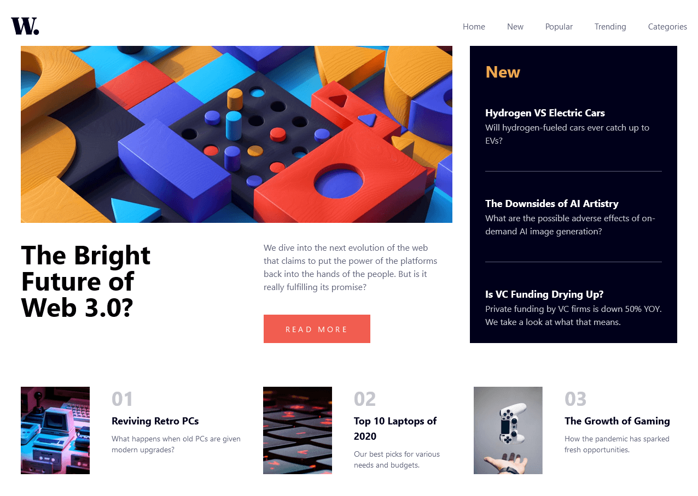
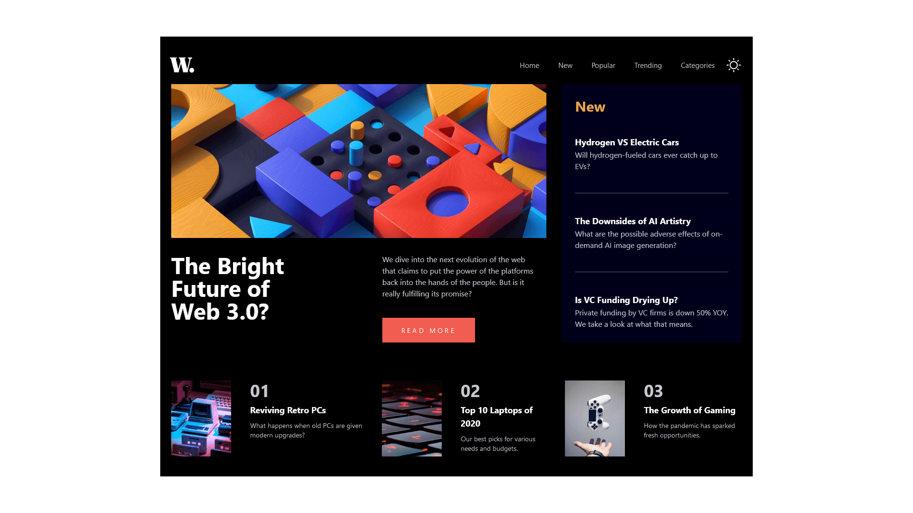
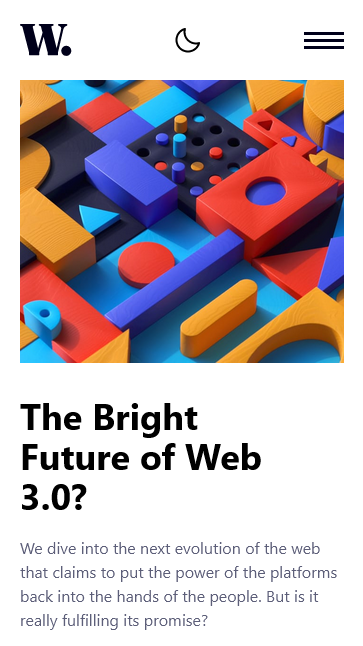
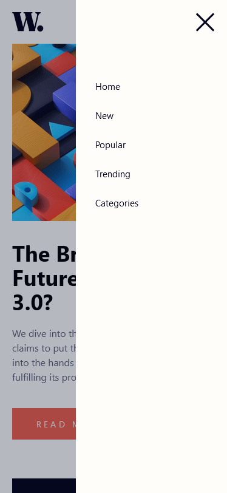

# Frontend Mentor - News homepage solution

This is a solution to the [News homepage challenge on Frontend Mentor](https://www.frontendmentor.io/challenges/news-homepage-H6SWTa1MFl). Frontend Mentor challenges help you improve your coding skills by building realistic projects.

## Table of contents

- [Frontend Mentor - News homepage solution](#frontend-mentor---news-homepage-solution)
  - [Table of contents](#table-of-contents)
  - [Overview](#overview)
    - [The challenge](#the-challenge)
    - [Screenshot](#screenshot)
    - [Links](#links)
  - [My process](#my-process)
    - [Built with](#built-with)
    - [What I learned](#what-i-learned)
    - [Continued development](#continued-development)
    - [Useful resources](#useful-resources)
  - [Author](#author)

## Overview

### The challenge

Users should be able to:

- View the optimal layout for the interface depending on their device's screen size
- See hover and focus states for all interactive elements on the page

**Noted: In this Project I add DarkMode into it to improve my Tailwindcss skills with config file. You can change width of the mobile version in the config file.**

### Screenshot

- Desktop Version:

  
  

- Mobile Version:

  
  

### Links

- Solution URL: ~~[Link](#)~~
- Live Site URL: ~~[Link](#)~~

## My process

### Built with

- Semantic HTML5 markup
- CSS custom properties
- Flexbox
- Grid
- Desktop-first workflow
- [TailwindCSS](https://tailwindcss.com/) - For styles

### What I learned

Hard to maintain all the code when your code start to get into more line of code. I should have use Framework like [ReactJS](https://reactjs.org/) to split the component into it old file for easily maintenance.

To impove this solution I should look into picture tag from HTML to improve quality code ` display: none;` the mobile image when in desktop mode and hide desktop image when in mobile.

From:

```html
<>
  
  
</>
```

To:

```html
<picture>
  <source
    media="(min-width:375px)"
    srcset="./assets/images/image-web-3-desktop.jpg"
  />
  
</picture>
```

### Continued development

I am really interested in design and I can see myself in the future use grid more often than today.

### Useful resources

- [Tailwind Component](https://tailwindcomponents.com/cheatsheet/) - This is a cheat sheet for TailwindCSS when I am stuck with their class name. Example: `display: none` in Tailwind is `hidden`

## Author

- Website - [Lim Tangmeng](https://www.limtangmeng.vercel.com)
- Frontend Mentor - [@Lim Tangmeng](https://www.frontendmentor.io/profile/ImFropZ)

