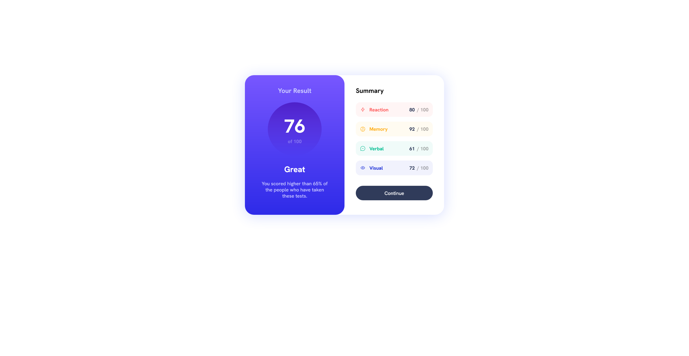
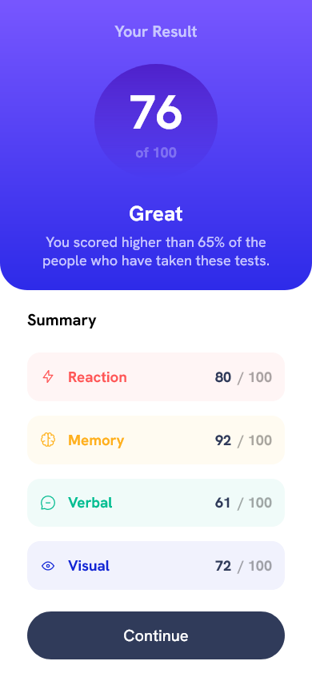

# Frontend Mentor - Product preview card component solution

This is a solution to the [Product preview card component challenge on Frontend Mentor](https://www.frontendmentor.io/challenges/product-preview-card-component-GO7UmttRfa). Frontend Mentor challenges help you improve your coding skills by building realistic projects.

## Table of contents

- [Frontend Mentor - Product preview card component solution](#frontend-mentor---product-preview-card-component-solution)
  - [Table of contents](#table-of-contents)
  - [Overview](#overview)
    - [The challenge](#the-challenge)
    - [Screenshot](#screenshot)
    - [Links](#links)
  - [My process](#my-process)
    - [Built with](#built-with)
    - [Useful resources](#useful-resources)
  - [Author](#author)

## Overview

### The challenge

Users should be able to:

- View the optimal layout depending on their device's screen size
- See hover and focus states for interactive elements

### Screenshot

- Desktop Version:

  

- Mobile Version:

  

### Links

- Solution URL: [Link](https://github.com/ImFropZ/Frontend-Mentor/tree/main/results-summary-component-main)
- Live Site URL: [Link](https://frontend-mentor-fropz.vercel.app/results-summary-component-main)

## My process

### Built with

- Semantic HTML5 markup
- CSS custom properties
- Flexbox
- [BEM](https://getbem.com/naming/) class naming
- Mobile-first workflow
- [SCSS](https://sass-lang.com/documentation/syntax) - For styles

### Useful resources

- [BEM 101](https://css-tricks.com/bem-101/)

## Author

- Website - [Lim Tangmeng](https://www.limtangmeng.vercel.com)
- Frontend Mentor - [@Lim Tangmeng](https://www.frontendmentor.io/profile/ImFropZ)
